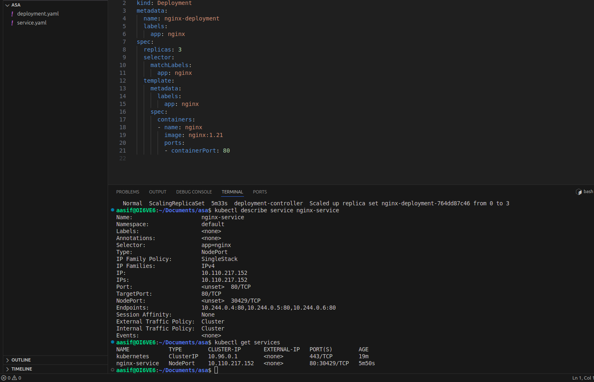

# Kubernetes Cluster with Minikube

I deployed a local Kubernetes cluster using Minikube and created an nginx application.

## Steps
1. Started Minikube cluster: `minikube start --driver=docker`
2. Created `deployment.yml` and `service.yml` files
3. Applied configurations: `kubectl apply -f deployment.yml` and `kubectl apply -f service.yml`
4. Scaled deployment: `kubectl scale deployment nginx-deployment --replicas=5`

## Screenshots

**Pods:**

**Services:**

## Files
- deployment.yml
- service.yml
